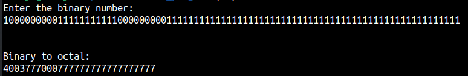
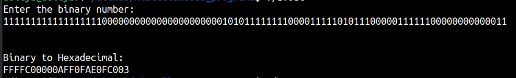
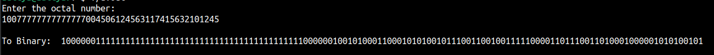
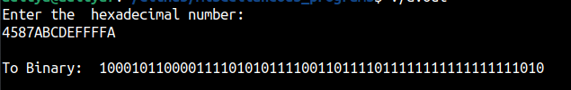
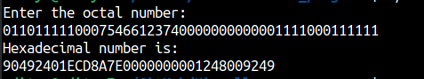
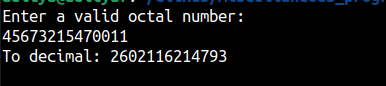

This repository contains a collection of different programs written in C, C++, Python.

Sample output of the binary_to_octal:

binary_to_hex:

octal_to_binary:

hex_to_binary:

octal_to_hex:

octal_to_decimal:

